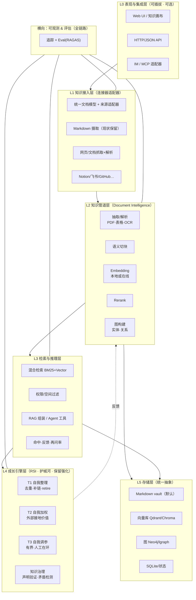

# kb-kit-pure 优化架构设计方案

> 一句话定位这份文档：kb-kit-pure 的**内核（会自成长的 RSI 引擎）是它的护城河**，但**外壳是"一个人用的脚本集合"**。本文对标腾讯 WeKnora 与一批主流开源知识库框架，诊断当前架构为什么"看起来 low"，给出一套**不破坏其本地优先/零依赖初心**的**分阶段演进架构**。

> 背景说明：本轮联网搜索（`web_search`）端点配置异常（404），`web_fetch` 受带宽限制且若干 GitHub raw 路径失效；下文"主流框架画像"部分依据作者对 RAG/知识库领域的既有知识给出，均为**已公开、广为人知的开源项目**，非虚构。涉及具体版本/STAR 等会随时间变化的数字时，以"量级/定位"描述为主，避免给出不准确细节。

---

## 目录
1. [现状诊断：我们到底在哪](#一现状诊断我们到底在哪)
2. [对标：WeKnora 与主流知识库框架](#二对标weknora-与主流知识库框架)
3. [能力矩阵：kb-kit vs WeKnora vs 主流框架](#三能力矩阵kb-kit--weknora--vs-主流框架)
4. [目标架构：分层 + 一个保留的护城河](#四目标架构分层--一个保留的护城河)
5. [五大重点优化方案（按优先级）](#五五大重点优化方案按优先级)
6. [技术选型建议（贴合你的约束）](#六技术选型建议贴合你的约束)
7. [演进路线图（0 / 1 / 3 / 6 个月)](#七演进路线图0--1--3--6-个月)
8. [风险与边界（防塌四条闸）](#八风险与边界防塌四条闸)
9. [MVP：最小可行的一步](#九mvp最小可行的一步)

---

## 一、现状诊断：我们到底在哪

### 1.1 真实结构（实测）

kb-kit-pure 目前 = **一个以 Markdown vault 为存储、以 Python 标准库脚本为引擎、以 CLI 为唯一接口的个人知识工作流**。

- **存储层**：扁平 Markdown 文件（PARA 目录）+ `.kb/state/` 状态 + `vector index/df_idf.json`（自建 DF-IDF 索引，schema v2）+ 少量 SQLite。
- **检索层**：`rag.py` —— 手写 TF-IDF/BM25 风格检索，中文按**字符 unigram+bigram 分词**（无 jieba），可选 ORNITH 凭证时调 vLLM 生成答案。**用户检索路径刻意避开神经 embedding**。
- **成长引擎（RSI，核心资产）**：`kb_engine.py`(T1/T2/T3 编排)、`kb_rsi.py`(指标·去重)、`kb_claim.py`(声明验证)、`kb_usage.py`(再问率·查询成功率)、`kb_embed.py`(probe)、`kb_fitness.py`(Simpson 多样性 + 矛盾零分)、`kb_contradiction.py`(否定密度差双闸)。
- **摄取**：`memory_ingest.py` / `memory_ingest_json.py` / `memory_ingest_sqlite.py`（**三套摄取变体并存**）、`kb_ingest.py`、`ingest_chat.py`、`ingest_convert.py`、`intake_triage.py`。
- **治理**：`clean.py`、`sync.py`、`validate.py`、`recall_schedule.py`、`kb_health.py`、`kb-healthcheck.py`、`dashboard.py`、`graph.py`、`link_engine.py`。
- **插件/多 Agent**：`plugin_registry.py`、`agent_registry.py`、`plugin_base.py`（DSH/OpenClaw/Hermes 记忆摄取适配）。

### 1.2 为什么"看起来 low"（5 大结构性短板）

> 注意：low 的不是"想法"，是**工程形态**。你的 RSI 想法很超前，但包裹它的形态像 2019 年的个人脚本仓库。

| # | 短板 | 实测证据 | 后果 |
|---|------|----------|------|
| 1 | **脚本荒原，无服务分层** | `pipeline/` 下 ~35 个 .py 平铺，靠 `import` 共享 `ROOT_DEFAULT` 等全局常量；无包/无 API 无进程边界 | 改一处怕动全身；无法独立部署/扩缩；新人无从下手 |
| 2 | **重复造轮子** | 3 套 ingest、`clean`/`sync`/`feedback_loop` 功能重叠、`validate.py` 与 healthcheck 交叉 | 维护成本翻倍；行为不一致；文档难写 |
| 3 | **零接口、零 UI、零多用户** | 唯一入口是 `argparse` subcommand；无 HTTP API、无鉴权、无多租户 | 只能你一个人 SSH 命令行用；无法嵌入别的产品/IM/网页 |
| 4 | **无连接器/集成生态** | 没有对接 Notion/飞书/Confluence/GitHub 等外部来源；纯手工丢进收件箱 | 知识供给全靠手搓，违背"知识无上限"的初衷（外部接地不足） |
| 5 | **检索停在"手写 BM25"** | `rag.py` 自研词法、无 rerank、无图谱、无权限过滤、无评估 | 在"可溯源·企业级"尺度上召回/精度上限低，且无可观测性证明质量 |

**反过来说，kb-kit 有两个 WeKnora 没有、且更值钱的东西**：
1. **RSI 自成长内核**——会代谢、免疫、自我加权、自我调参的"有机 KB"；
2. **本地优先 / 零依赖哲学**——标准库可跑、数据不出机器、离线可用。

> 结论：**优化 ≠ 把 kb-kit 改写成第二个 WeKnora**（那会丢掉它的灵魂，也不符合"一人·低成本·本地"约束）。优化 = **给 RSI 内核配一个现代化、可扩展、可观测的外壳**，让"会成长的 KB"能被更多人、更多源、更深的检索方式用起来。

---

## 二、对标：WeKnora 与主流知识库框架

### 2.1 WeKnora（腾讯开源，已实测其 `internal/` 结构）

定位：**企业级 AI 知识库平台**（Go 后端 + Vue3 前端 + 小程序）。它的架构是**"分层单体 microservice-monolith"**，值得学的不是某个功能，而是**分层方式与可扩展点**：

```
前端层   client/ (Vue3+Vite)  ·  frontend/  ·  miniprogram  ·  desktop(Wails)
         ───────────────────────────────────────────────────────────────
应用服务   internal/agent/ (skills·compaction·token·approval·tools = 完整 Agent 运行时)
           internal/searchutil · runtime · router · middleware · ratelimit
数据接入   internal/datasource/connector/* (gitlab·confluence·yuque·dingtalk·notion·rss·feishu…)
           internal/im/* (slack·telegram·dingtalk·wechat·wecom·mattermost·qqbot·yunzhijia)
智能链     internal/docparser/anydoc · textconv · chunker · embed·rerank(searchutil)
存储抽象   internal/storage* (+storageallowlist = 权限感知的可插拔存储)
可观测     internal/tracing/langfuse · mcp/mcpserver (互操作)
部署       docker/ · helm/ · docker-compose · migrations
```

WeKnora 的 **6 个可迁移理念**（不是照抄代码）：
1. **统一文档模型 + 连接器适配器模式**：18+ 来源收敛成一份内部 Document 结构。
2. **权限感知检索（ACL-aware）**：检索前就做租户/空间过滤，不是查完再筛。
3. **Agent 作为一等接口**：工具调用、审批闸、上下文压缩是基础设施，不只是"聊天框"。
4. **MCP 互操作**：让外部 Agent 能调用你的知识与工具。
5. **可观测先行**：Langfuse 全链路追踪 + eval。
6. **存储 behind 接口**：Vector/PG/Graph/Object 统一抽象，运行时可换。

### 2.2 主流开源知识库框架画像（既有知识，量级/定位为准）

| 框架 | 一句话定位 | kb-kit 可借鉴的点 |
|------|-----------|------------------|
| **Danswer**（OpenDanswer） | 开源企业搜索+聊天，连接器生态 + 权限感知识库，自托管 | **权限感知检索**、连接器适配模式、"检索即入口"的产品观 |
| **RAGFlow**（Labring） | **深度文档理解**（OCR/表格/可视化解析）+ 模板化切块 + 可见推理 | **文档解析管线**（kb-kit 目前几乎不解析 PDF/表格，只吃 Markdown） |
| **Dify** | LLM 应用**低代码**平台：可视化 RAG 流水线 + Agent + Prompt IDE + 可观测 | **可视化编排**、Prompt/模型版本管理、evaluation 内建 |
| **FastGPT** | 中文友好的 RAG 平台，可视化流水线，知识管理强 | 中文 RAG 工程化、知识"库→集→切块→索引"的结构化管理 |
| **Quivr** | 个人 AI 知识库（"第二大脑"），RAG + 多模态 | C 端体验、多模态摄取、个人知识产品化叙事 |
| **Letta（原 MemGPT）** | **以持久记忆为第一等公民的 Agent**，本地 LLM | 与 kb-kit RSI 最同构——**把记忆当可管理、可压缩、可检索的持久态** |
| **Qdrant / Chroma / Weaviate / Milvus** | 向量数据库（基础设施层） | 向量存储与 HNSW 检索，替代手写 DF-IDF |
| **Affine / Notion** | 知识画布 / Wiki（表现层） | 知识管理与协作的 UI 范式 |
| **RAGAS / TruLens / LangSmith** | RAG 评估工具链 | **评估先行**：faithfulness / 答案相关性 / 上下文召回，用数据证明质量 |

### 2.3 从它们身上提炼的"现代知识库最佳实践"（12 条）

1. **可插拔连接器/adaptor**：统一文档模型 + 来源适配器。
2. **文档智能管线**：抽取 → 解析 → 切块 → embedding → rerank（深度解析，非仅文本切分）。
3. **混合检索**：BM25 关键词 + 向量 + rerank（ reciprocal rank fusion 融合）。
4. **图谱增强 RAG（KG-RAG）**：实体/关系抽取、多跳推理、社区聚类等价聚合。
5. **权限感知识检索**：检索前按 ACL 过滤。
6. **Agent 运行时 + 工具调用 + MCP**。
7. **可观测先行**：追踪 + eval + prompt/模型版本管理。
8. **评估 harness**（RAGAS 式：faithfulness、答案相关性、上下文召回）。
9. **存储 behind 接口**：Vector/Graph/Object/Relational 统一抽象。
10. **多租户 + RBAC + SSO**（企业场景）。
11. **provider-agnostic LLM 路由器**（25+ 模型运行时切换，WeKnora 已做）。
12. **增量/CDC 摄取**：来源变更自动同步，而非全量重扫。

---

## 三、能力矩阵：kb-kit vs WeKnora vs 主流框架

> 评分：● 原生具备 ○ 具备/可低成本获得 ◐ 部分 △ 缺失

| 能力维度 | kb-kit-pure（现状） | WeKnora | 主流框架聚合 | 目标（kb-kit 演进后） |
|----------|:---:|:---:|:---:|:---:|
| RSI 自成长内核 | ● | △ | ○ | **●（保留并强化）** |
| 本地优先 / 数据不出机 | ● | ◐ | ◐ | ● |
| 标准库零依赖 | ● | △ | △ | ◐（引擎可零依赖，外壳可选） |
| 分层 / 可部署架构 | △ | ● | ● | ● |
| 消除重复 / 单一事实源 | △ | ● | ● | ● |
| 混合检索（BM25+向量+rerank） | ◐(仅BM25) | ● | ● | ● |
| 文档深度解析（PDF/表格/OCR） | △ | ● | ●(RAGFlow) | ○→● |
| 知识图谱 / 多跳推理 | △ | ● | ◐ | ○→● |
| 可插拔连接器（18+来源） | △ | ● | ◐ | ○→● |
| 可观测 / eval | △ | ● | ● | ○→● |
| 权限感知识检索 | △ | ● | ●(Danswer) | ○ |
| Agent 运行时 + MCP | ○(多Agent摄取) | ● | ◐ | ○→● |
| Web UI / API / 多用户 | △ | ● | ● | ○→● |
| 容器化 / 部署 | ○ | ● | ● | ● |

**关键判断**：kb-kit 在"RSI 内核 + 本地优先"两列已经是 **●**（领先），真正的差距集中在**中间工程列**（分层、检索深度、连接器、可观测）。这些恰恰是**投入产出比最高、最该补的短板**——而不用去和 WeKnora 拼"连接器数量/多租户"那种重资产。

---

## 四、目标架构：分层 + 一个保留的护城河

核心原则：**分层是把"会成长的引擎"和"可替换的外壳"解耦**。内层（RSI + 检索）保持你的本地/零依赖哲学；外层（连接器、UI、可观测、部署）按需长成现代化产品形态，且**可插拔、可取舍**（一个人能维护的规模）。



**分层收益**：
- **L4 成长引擎**独立成层 → RSI 改动有明确边界、可回滚锚点清晰（正好对接你已有的 git-checkpoint 铁律）。
- **L2/L3 检索管道**可独立升级（先上 hybrid+rerank，再上 KG），不动引擎。
- **L1/L0 外壳**可插拔可取舍：一个人先做 Markdown+网页摄取和 Web UI，连接器/IM/MCP 后续再加。
- **L5 存储 behind 接口**：默认仍用 Markdown vault（守住本地优先），但**留一个向量库接口**，随时把 `df_idf.json` 换成 Qdrant/Chroma。

---

## 五、五大重点优化方案（按优先级）

### P0-1 · 结构化分层 + 消除重复 + 单一事实源（地基，最高 ROI）

**做什么**：把 `pipeline/` 的脚本荒原，收敛为**包结构 + 明确分层**，每个职责只有一个实现。

- 建立包：`kb_ingest/`、`kb_pipeline/`（extract→chunk→embed→rerank）、`kb_search/`（hybrid+eval）、`kb_growth/`（RSI: T1/T2/T3）、`kb_storage/`（vault/vector/graph adapters）、`kb_plugins/`、`kb_api/`。
- **消除重复**：3 套 ingest → 合并为 1 个 `ingest` + 来源插件（`memory_ingest_json/sqlite` 作为插件）。`clean`/`sync`/`feedback_loop` 合并为治理模块的单一入口，保留 alias 兼容旧 CLI。`validate.py` 能力并入 `kb_health`。
- **统一文档模型**：一份 `Document{id, source, content, meta, chunks, embeddings_ref, perms}`，所有上游写它、所有下游读它。这是"可插拔连接器"的前提。

**收益**：维护成本立降，行为一致，文档/测试可写。**风险低、可回滚**，完全符合 RSI-T1 的安全边界。

### P0-2 · 检索升级为"混合检索 + rerank + 评估"（体验质变，性价比最高）

**做什么**：在**不动你"用户检索走确定性路径"哲学**的前提下补精度：

- **混合检索**：保留你已有的 TF-IDF/BM25 作为一路，新增**轻量 embedding 路**（可本地小模型，或可选在线），两条结果做 **RRF（互逆秩融合）**。给你已有的 `df_idf.json` 加一列 embedding 索引，渐进升级，不必一次性推翻。
- **Rerank**：对融合后的 top-k 做重排（`rerank.py` 已有雏形，补成通用 reranker）。
- **评估 harness**：引入 RAGAS 式三指标（**faithfulness 忠实度 / 答案相关性 / 上下文召回**），跑一个**小标注集**做基线。这是把"我觉得检索变好了"变成"数据证明变好了"——也正好给 RSI-T3 调参提供**外部接地信号**（闭环的关键）。

**收益**：召回/精度显著提升且**可量化**；与 RSI 的"外部接地"理念天然耦合。

### P1-1 · 可插拔连接器 + 文档智能管线（扩大"知识供给"）

**做什么**：把"手动丢进收件箱"升级为"来源适配器自动摄取"。

- **统一文档模型 + 适配器接口**：`Adapter.extract(source) -> list[Document]`。
- **第一阶段（低成本、你大概率自己做）**：Markdown（保留）+ **网页抓取** + **PDF/纯文本解析**。参考 **RAGFlow** 的文档理解思路，至少做好 Markdown/HTML/PDF 文本层。
- **第二阶段（价值高但偏重）**：Notion/飞书/Confluence/GitHub 等，参考 **Danswer** 的连接器适配模式，做成可插拔插件。
- **增量/CDC**：来源变更只同步增量，而非全量重扫。

**收益**：真正兑现"知识无上限"（外部接地是 RSI 不塌的唯一机制）。**风险**：这部分偏重，**建议做成可选插件**，不硬塞进零依赖核心。

### P1-2 · 知识图谱（KG-RAG）——把"补链"升级为"推理"

**做什么**：你已有的 `graph.py` / `link_engine`（孤立笔记补链）是**关系补全**的雏形，往上是**实体抽取 + 关系构建 + 多跳检索**。

- 从笔记抽取**实体/关系** → 知识图谱（可落 Neo4j 或轻量图）。
- 检索时走**多跳推理 / 社区聚类等价聚合**（RAG 2.0/3.0 范式）。
- 与 RSI 结合：图谱的**一致性**本身就是矛盾检测的天然载体（呼应你已有的 `kb_contradiction`）。

**收益**：kb-kit 从"检索笔记"进化到"推理知识"，这是企业级与个人脚本的分水岭。**建议后做**（投入大，先确保 P0/P1 地基稳）。

### P2 · 可观测 & 表现层 & 互操作（让它"像产品"）

- **可观测（横向贯穿 L1–L4）**：全链路追踪 + eval 看板。哪怕先用最轻的日志+指标，也要让"知识健康度/检索质量"可视化（对标你的 `kb_health` / `dashboard`，但接上真实检索质量指标）。
- **表现层**：一个最小 Web UI（检索 + 反馈 + 知识治理面板）+ 稳定 HTTP/JSON API。参考 **Dify/FastGPT** 的"检索即产品"观。
- **互操作**：暴露 **MCP** 接口，让外部 Agent 能调用你的知识与工具（参考 WeKnora 的 `mcpserver`）——这也能让你的 RSI 引擎接入更多 Agent，形成正向循环。

> **取舍建议**：P2 的三个方向**不要同时上**。对"一人项目"，先做 **Web UI + API（自用/给同事用）**，再考虑 MCP，连接器按需长。

---

## 六、技术选型建议（贴合你的约束）

你的硬约束：**本地优先、带宽受限、一人维护、守住"知识不出机器"**。据此选型（均自托管、开源）：

| 层 | 建议 | 为什么（贴合约束） |
|----|------|------------------|
| 形态 | **分层 + 可选外壳**：核心（RSI+确定性检索）保持标准库/轻依赖；外壳（API/UI/连接器）用可选模块 | 守住零依赖初心，同时现代化 |
| 向量库 | **Chroma（本地/极简）**起步 → 数据量/并发上来再迁 **Qdrant（自托管、API 干净）** | 零外部依赖、离线可跑 |
| 图数据库 | **Neo4j（自托管）**或轻量图结构起步 | 做 KG-RAG |
| 文档解析 | **自研 Markdown/HTML + 引入 pdfplumber/markitdown**，重度 OCR 参考 RAGFlow | PDF/表格是短板，优先补 |
| Rerank | 本地小模型 reranker 或 `bge-reranker` | 本地可跑，不依赖外网 |
| LLM 路由 | provider-agnostic 路由器（你有 ORNITH/vLLM 本地凭证） | 复用现有本地模型资产 |
| 可观测 | 起步：**日志 + 自建 eval 看板**；规模化再上 Langfuse/Phoenix | 不引入重运维 |
| 部署 | 现状 `install.sh/.ps1/.bat` 保留；新增 **docker-compose** 一键起全栈 | 你的"一键部署"卖点要守住 |
| 前端 | 若做 UI：**Astro/Nuxt 轻量栈** 或你更熟的栈 | 一人可维护 |

**两条铁律**：
1. **外壳模块默认不装**，保持"装了 Python 就能跑核心"的初心。
2. **任何联网能力（embedding/rerank/连接器）都要有本地兜底降级**（你已有 `kb_embed.available()` 守卫，继续发扬）。

---

## 七、演进路线图（0 / 1 / 3 / 6 个月）

> 原则：**先打地基（P0，低危高回报）→ 再涨体验（P1）→ 最后像产品（P2）**。每阶段都可独立交付、可回滚，符合 RSI 的"有界·可回滚"。

| 阶段 | 时间 | 交付 | 对应方案 | 风险 |
|------|------|------|----------|------|
| **Phase 0 · 打地基** | 0–1 月 | 包结构分层；消除 3 套 ingest 重复；统一 `Document` 模型；`df_idf.json` 加 embedding 列做混合检索+RRF；补 rerank；上 RAGAS 三指标基线 | P0-1 + P0-2 | 低（纯重构+增量） |
| **Phase 1 · 涨体验** | 1–3 月 | 最小 Web UI + HTTP API；网页+PDF 摄取适配器；连接器插件框架（先 1–2 个高频来源） | P1-1 + P2-表现层 | 中 |
| **Phase 2 · 深推理** | 3–6 月 | 知识图谱（实体/关系抽取）→ KG-RAG；多跳检索；矛盾检测与图谱一致性联动 | P1-2 | 中高（投入大） |
| **Phase 3 · 像产品** | 6+ 月 | MCP 互操作；可观测看板（追踪+eval）；增量/CDC 摄取；按需多租户/权限过滤 | P2-互操作/可观测 | 中 |

**每条路线图的"停止标准"**：每阶段结束时有**评估指标证明变好**（召回/忠实度/再问率），否则回滚。这正是 RSI 的"可回滚 + 数据说话"。

---

## 八、风险与边界（防塌四条闸）

> 你在 `RSI-自我改进设计.md` 里已经写得很清楚（Model Collapse / Self-Improvement Paradox / 开放 vs 闭合 RSI）。这里只做**架构层面的映射**，把"理念"落成"结构"：

| RSI 防塌原则 | 架构落点 |
|--------------|----------|
| **外部真值接地** | P0-2 的 eval + P1-1 的外部来源摄取 + 用户 useful/not-useful 反馈（`record_hit` 升格为适应度信号） |
| **可测的适应度** | RAGAS 三指标 + 再问率/查询成功率（`kb_usage`），**趋势而非绝对值**作调参依据 |
| **有界且可回滚** | 分层 → 每层改动有清晰边界；沿用 git-checkpoint 铁律；T3 默认人工在环、保守小步 |
| **多样性注入** | `kb_fitness` 的 Simpson 多样性 + 来源多样性（多连接器天然带来） |
| **Goodhart 规避**（关键） | 凡是"能被引擎写操作单调抬高"的指标（健康度/补链数），**必须**与外部信号（真实查询效果、用户反馈）耦合，否则导向自抬数字 |

> 一句话：**kb-kit 的"无上限"不来自"自己迭代自己到爆炸"，来自"永远保持摄入真实知识 + 用真实查询效果当标尺"**。架构要做的，就是把这个闭环做成**结构化的、可观测的、可回滚的**，而不是靠人肉自觉。

---

## 九、MVP：最小可行的一步

**如果只做一个阶段**：做 **Phase 0**。它零产品风险、纯工程收益，且直接解决"low"的核心（脚本荒原 + 检索单薄）：

1. 把 `pipeline/` 按 L1–L4 重新分包，消除 3 套 ingest，统一 `Document` 模型。
2. `df_idf.json` 兼容层加一路 **embedding 检索**（先本地小模型或可选在线），与现有 BM25 做 **RRF 融合**。
3. 补通用 **rerank**。
4. 上 **RAGAS 三指标**基线（找 20–50 条真实问答做标注集）。

交付后即可用**数据**证明"检索质量提升 X%"，并给 RSI-T2/T3 提供**外部接地信号**——一步同时解决"工程形态 low"和"RSI 需外部接地"两个命题。

---

### 附：与 WeKnora 的本质区别与取舍

| 维度 | WeKnora | kb-kit-pure（演进方向） |
|------|---------|------------------------|
| 基因 | 产品平台（多租户/连接器/IM） | 会成长的个人/团队 KB |
| 语言 | Go + TS（重） | Python 核心（轻）+ 可选外壳 |
| 强项 | 广度（18+来源、全栈、企业级） | 深度（RSI 自成长 + 本地优先） |
| 策略 | 做"全" | **做"深" + 关键"广"（连接器/可观测按需补）** |

**不要做成"又慢又重的第二个 WeKnora"**。kb-kit 的胜负手在**把 RSI 这个差异点做到 WeKnora 没有的深度**（自治理知识 + 外部接地的成长闭环），同时用现代化分层让它**能被复用、可观测、可扩展**——广度处补连接器与可观测即可，不必全面对标。

---

*本方案基于对 kb-kit-pure 真实源码（`template-vault/pipeline/`）、README 定位，与 WeKnora 真实 `internal/` 结构的实测对比；主流框架画像为既有知识、量级描述为准。*
