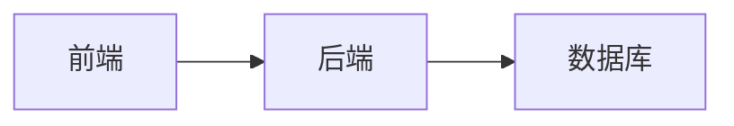

---

tags: [template, project]
status: draft
domain: 综合
created: 2026-08-05
updated: 2026-09-03
importance: 0.98
kb_target: 50-模板 Templates
kb_action: new
kb_summary: {{项目名称}}
phase: 需求|设计|开发|测试|上线|运维
priority: P0|P1|P2
category: template

---

# {{项目名称}}

> 一句话项目简介（解决什么问题，服务谁）

## 📌 基本信息

| 字段 | 值 |
|------|-----|
| 状态 | `draft` / `active` / `stable` / `legacy` |
| 优先级 | P0 / P1 / P2 |
| 时间线 | {{start}} → {{end}} |
| 技术栈 | 前端 / 后端 / 数据库 / 部署 |
| 负责人 | |

## 🎯 目标与范围

- 目标 1
- 目标 2

## 🏗️ 架构

## 📦 模块清单

| 模块 | 说明 | 状态 |
|------|------|------|
| | | |

## 📝 关键决策记录

- [决策 1]（日期）：原因
- [决策 2]（日期）：原因

## 📈 进度

- [ ] 需求评审
- [ ] 架构设计
- [ ] 开发
- [ ] 测试
- [ ] 上线

## 🧠 经验教训

- 教训 1

## 🔗 相关链接

- [[相关笔记]]
